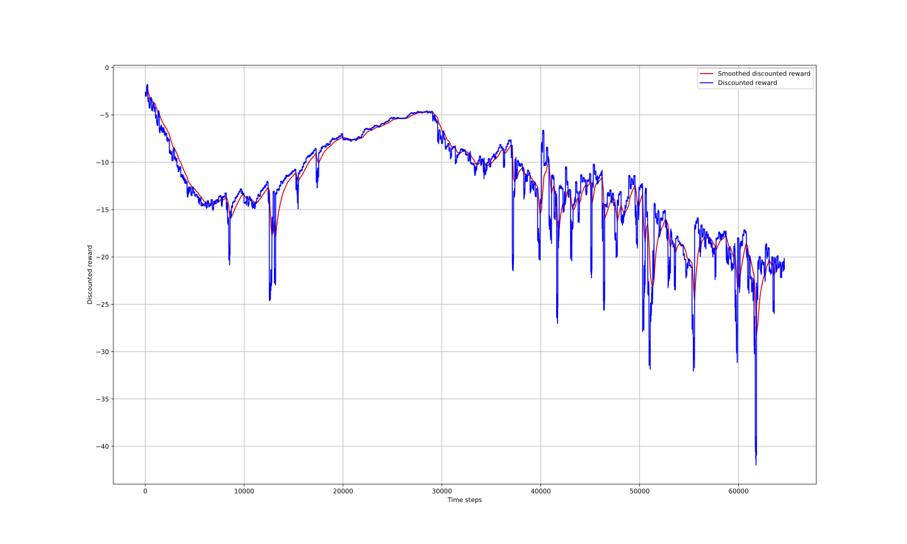

# Robotics Project

This repo hosts the code relative to my Robotics project of the
posgraduate program in applied Artificial Intelligence hold at 
Erasmushogeschool Brussel (EhB). In this project, we try to solve
the following problem: a person is allowed to hold a Raspberry Pi
in front of a laptop’s front camera. The goal is to train a RL agent
so that the red light on the Pi’s LED matrix is as close a possible
to the webcam’s image center despite the Pi being moved and/or rotated
in front of this camera.

## Installation

In order to run the code, simply create a new conda environment using:

```python
conda env create --file env.yml
```

Then, make sure to run the setup.py file for local dependencies:

```python
pip install -e .
```

Now you're good to go! Be aware that in order to run the code, you must 
provide access to the Pi by typing its IP address in the Network class.
To enjoy a trained agent, simply run the main.py script with the following 
lines:

```python
from src import Agent
from stable_baselines import PPO2

if __name__ == "__main__":
    agent = Agent(model=PPO2)
    agent.evaluate(tensorboard_log='./evaluation/', model_path='/checkpoint_2')
```

Feel free to edit this file according to your needs.

## Code Structure

The code is organized around the following parts:

### src
   Source code of the project. It contains the support for the agent as well as
   the associated gym environment. The network and processing scripts are aimed
   to respectively provide access to the server and to process the image captured
   by the PC's webcam. The calibrate.py file allows to play around with OpenCV so
   as to find the optimal filters requird to retrieve the position of the red dot.
   Finally, the checkpoints and the trial directories respectively store intermediate
   versions of an agent as well as the learning curves associated to it. The model 
   checkpoints directory contains the current version of the agent being trained and
   the evaluation directory allows to monitor an agent while being tested. 

### notebooks
   This folder contains the notebook required to load the data from tensorboard 
   logs into pandas for visualization. A typical learning curve obtained with this
   notebook is the one using PPO2 in *checkpoint_2*:
   
   

### doc
   The doc folder contains the pdf version of the report of this project. It is
   stored in the main.pdf file. There you will find a detailed description of this
   project along with the results obtained so far.

## Demonstration

To visualize a demonstration of the trained PPO2 agent of stable-baselines, check out the
following video:

    https://youtu.be/VGtoMPvjIwM

Feel free to leave some comments and open up issues if you run into troubles :=)